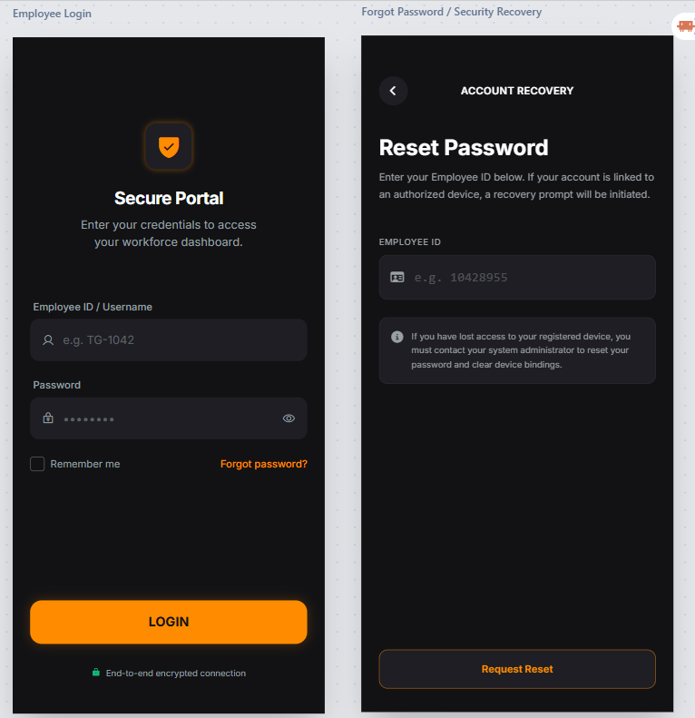
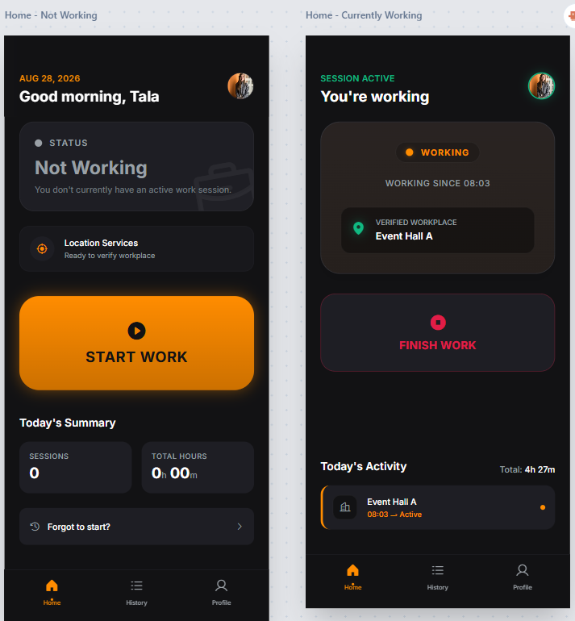
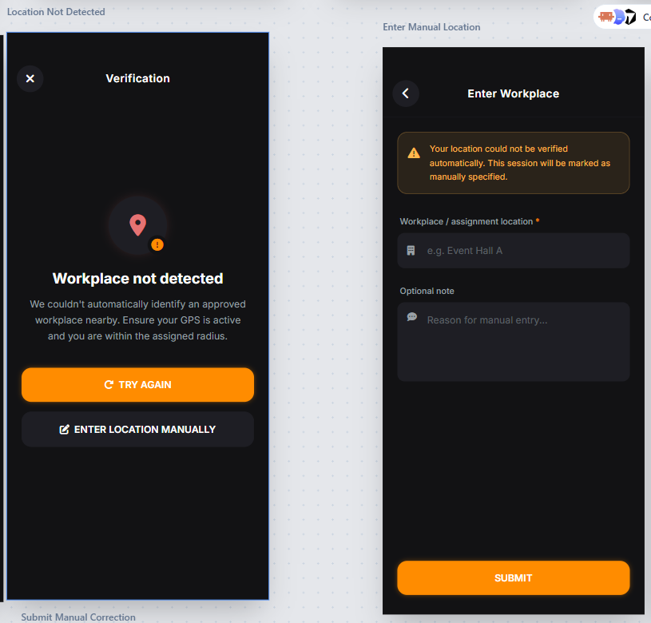
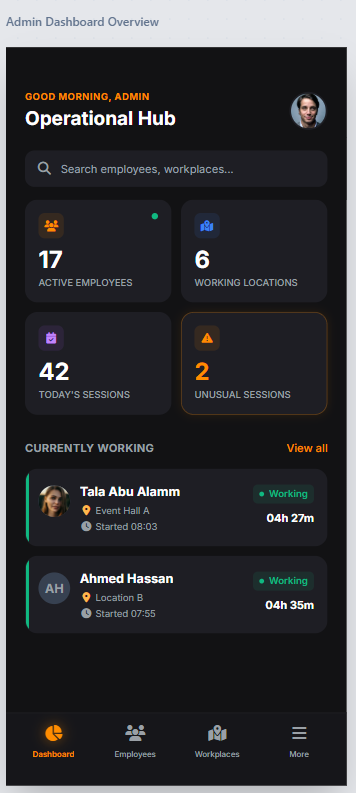

# Professional Security — Workforce Attendance Platform

A Flutter + Supabase mobile application that replaces paper/manual attendance tracking for a private security company with GPS-verified clock-in/clock-out, real-time admin oversight, and auditable attendance records.

This is a **real internal system built for a working security company**, not a demo or tutorial project. It was designed to solve an actual operational problem: the company runs guards across a mix of permanent sites (offices) and temporary assignments (event halls, concerts, private functions), and needed a reliable, tamper-resistant way to know who is working, where, and for how long.

---

## Objective

- Replace manual/paper attendance logs with a digital, GPS-verified clock-in/clock-out system.
- Give administrators real-time visibility into who is currently working and at which site.
- Make attendance data auditable — every correction an admin makes is logged with a reason.
- Support a workforce that isn't tied to a single fixed office, including temporary event-based assignments.
- Keep the app simple enough for a non-technical workforce (the target user base spans ages ~35–55).

---

## Key Features

### Employee

| Feature | Details |
| --- | --- |
| Authentication | Login with a 9-digit Employee ID + password (Supabase Auth under the hood) |
| Clock in / Clock out | "Start Work" / "Finish Work" flow with a live elapsed-time counter |
| GPS workplace verification | On start/end, the device's GPS position is checked against registered workplace geofences; a matching session is marked **verified** |
| Manual location fallback | If no workplace is detected (or the employee moves outside the geofence before ending), the session is recorded with a manual location and flagged **unverified, pending admin review** |
| Work history | Month-by-month session history with status badges (Verified / Manual / In progress) and who verified the session |
| PDF reports | Download a PDF of your own monthly sessions, with Arabic and Hebrew name/text support |
| Issue reporting | Send a short message to admins directly from the Home screen (e.g. to flag a problem) |
| Profile | View join date and completed-session count, change password, switch app language (English / Arabic / Hebrew, with full RTL layout) |
| Password reset | Employees without device access can request a reset that an admin fulfills |

### Administrator

| Feature | Details |
| --- | --- |
| Live dashboard | "Currently Working" list of active employees and sites, and an "Unverified Sessions" review queue |
| Employee management | Search employees, create new accounts (admin-provisioned, no public self-registration), activate/deactivate accounts |
| Session review | Approve/correct a GPS-mismatched or manually entered session, or force-end an employee's active session with a required reason |
| Session editing | Edit or delete any work session (start/end time, workplace) — every change is written to an audit log |
| Workplace management | Add, edit, and deactivate geofenced workplaces; new workplaces are calibrated using live GPS accuracy (effective radius = expected radius + measured GPS accuracy) |
| Reports | Generate a PDF attendance report for any employee for a selected month |
| Issue queue | View and resolve issues reported by employees |
| Password reset | Reset a locked-out employee's password on request |
| Super Admin | A separate tier that can promote/demote admins and manage administrator accounts, kept apart from day-to-day employee management |

### Security & Access Control

- **Role-based routing**: employees, admins, and super admins land on different experiences; the client never decides its own access level.
- **Server-authoritative GPS verification**: every workplace match is recomputed on the backend from submitted coordinates — a client can't claim to be at a location it isn't.
- **Server-authoritative timestamps**: session start/end times are set by the database, not sent by the client, preventing after-the-fact time tampering.
- **Row Level Security (RLS)** on every sensitive table in Postgres; employees can only ever read their own data.
- **Privileged writes go through SQL functions**, not direct table access — none of `work_sessions`, `devices`, or `audit_logs` accept client-side inserts/updates.
- **Audit logging**: every admin correction, verification, deletion, and role change is written to an `audit_logs` table with the actor, reason, and before/after data.
- **Inactive-account enforcement**: a deactivated employee is signed out both at login and on the next app launch if their account was deactivated mid-session.
- **Format validation enforced at the database level** (e.g. Employee ID format), not just in the UI, since client-side checks alone can be bypassed.

---

## Real-World Use Case

The system is built for a **private security company managing a workforce of guards across many locations** — a mix of fixed sites (offices) and temporary, time-boxed assignments (events, venues, private functions). It generalizes well to any organization that needs to:

- Track hourly/shift workers across multiple, non-fixed job sites.
- Verify attendance by location rather than trust self-reported time.
- Give supervisors a live view of who is currently on shift and where.
- Produce defensible, auditable attendance records for payroll or client billing.

---

## Technology Stack

| Layer | Technology | Purpose |
| --- | --- | --- |
| Client | **Flutter / Dart** | Cross-platform mobile app (Android + iOS) |
| Backend | **Supabase** | Auth, Postgres database, RLS, and server-side (`SECURITY DEFINER`) functions |
| Database | **PostgreSQL** (via Supabase) | Stores profiles, workplaces, work sessions, audit logs, and issue reports |
| Location | **geolocator** | Requests location permission and reads GPS coordinates for workplace verification |
| Reporting | **pdf**, **printing** | Generates monthly PDF attendance reports and hands them to the OS share sheet |
| Local storage | **shared_preferences** | Persists the selected UI language on-device |
| Internationalization | Custom lightweight JSON dictionaries + a hand-rolled Arabic text-shaping module | English / Arabic / Hebrew UI with RTL layout support |
| CI/CD | **Codemagic** | Automates the Android release build (`codemagic.yaml`) |

---

## Architecture Overview

```
Flutter mobile app (Android / iOS)
        │
        ▼
Supabase Auth  ──►  Employee ID mapped to an internal Supabase Auth identity
        │
        ▼
PostgreSQL (Supabase)
  ├─ Row Level Security  → employees can only read their own rows
  └─ SECURITY DEFINER functions → gate every session/workplace/admin write,
     re-deriving the caller's identity and role on the server, never trusting the client
        │
        ▼
Audit log ← every admin action (verify, edit, delete, activate, promote) is recorded
```

GPS verification follows the same server-authoritative pattern: the app submits coordinates, and the backend — not the client — decides whether they fall within a registered workplace's radius before marking a session verified.

---

## Platform Support

Built with Flutter for **Android and iOS** from a single codebase. Android release builds are automated through **Codemagic** (`codemagic.yaml` at the repo root generates the Supabase-backed config from secure CI environment variables and produces a signed release APK).

---

## Development & Deployment

The app was built incrementally, in defined phases (auth → session start/end → GPS verification → history → admin dashboard → admin management → reporting → localization → hardening), with manual testing after each phase before moving to the next. A production-readiness audit was carried out against the security and RLS model ahead of app store submission.

Supabase credentials are never committed — `lib/config/env.dart` is git-ignored and generated locally from `lib/config/env.example.dart`, or generated on CI from a Codemagic secure variable group.

---

## Project Structure

```
professional_security_app/
├── lib/
│   ├── config/        # Theme, environment config (gitignored secrets)
│   ├── models/        # Profile, WorkSession, Workplace, IssueReport, ...
│   ├── screens/        # Employee & admin screens (Home, History, Admin Dashboard, ...)
│   ├── services/       # Auth, Supabase data access, GPS, PDF reports, i18n
│   └── widgets/         # Shared UI components
├── android/, ios/       # Platform projects
└── assets/              # Fonts (incl. Arabic/Hebrew), language JSON files, logo

db_files/
├── dev-db/              # Iterative development schema + migrations, by phase
└── prod-bootstrap/       # Consolidated production schema (tables, RLS, functions)

UI_design/               # Original UI/UX design references used to guide the build
codemagic.yaml           # Android CI/CD build configuration
```

---

## UI/UX Design Reference

The screens below are early design mockups used to plan the app's look, flows, and feature set before implementation. The shipped app follows this visual language (dark theme, amber accent) and these core flows — clock in/out, GPS verification with manual fallback, and the admin dashboard — while some exact details evolved during development.

<table>
<tr>
<td><br/><sub>Employee login</sub></td>
<td><br/><sub>Employee home — not working / working</sub></td>
</tr>
<tr>
<td><br/><sub>GPS workplace verification / manual fallback</sub></td>
<td><br/><sub>Admin dashboard</sub></td>
</tr>
</table>

---

## Privacy & Security Note

This is an internal application built for a specific company's workforce. Production Supabase credentials, environment variables, employee data, and any client-identifying information are intentionally excluded from this repository. `lib/config/env.dart` and all real API keys are git-ignored; only a placeholder template is committed.

---

## Portfolio Note

This project reflects hands-on, end-to-end software engineering work on a real business requirement rather than a tutorial exercise. My role covered the full lifecycle:

- Gathered requirements from the client and defined the feature set and business rules (session rules, GPS/verification logic, role permissions).
- Made the technology choices (Flutter + Supabase) and designed the UI/UX flows and visual system used to guide the build.
- Broke the build into incremental phases and used Claude Code to accelerate implementation within each phase, while personally reviewing and testing every feature before moving forward.
- Designed the role-based access model (employee / admin / super admin), the server-authoritative GPS and timestamp verification approach, and the audit-logging strategy.

Mobile release builds were configured for CI/CD through Codemagic, and store deployment (Google Play and the Apple App Store) was carried out by a collaborating engineer, [**Noor Halabi**](https://github.com/noorhalabi911), using that pipeline.

This project demonstrates: mobile app development with Flutter, backend/database integration with Supabase and Postgres, role-based authentication and access control, location-aware application logic, and production-oriented deployment considerations.
